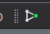
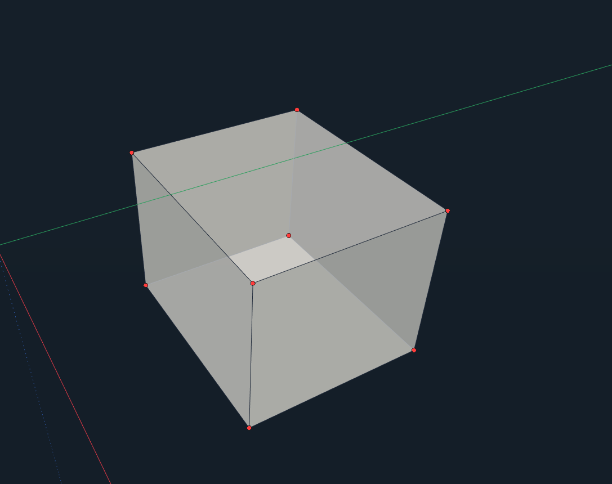
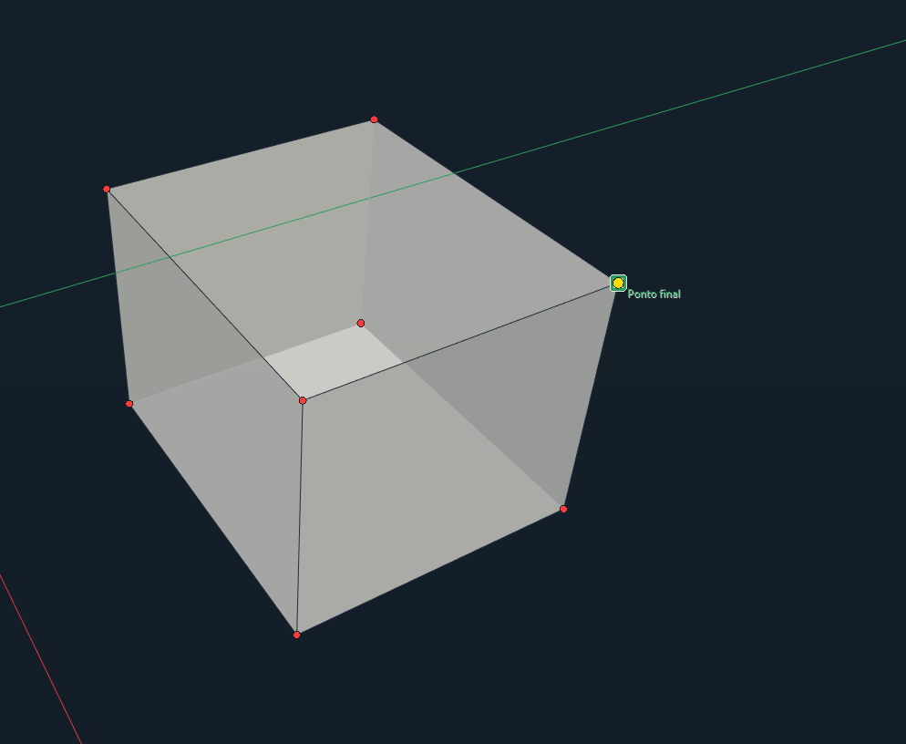
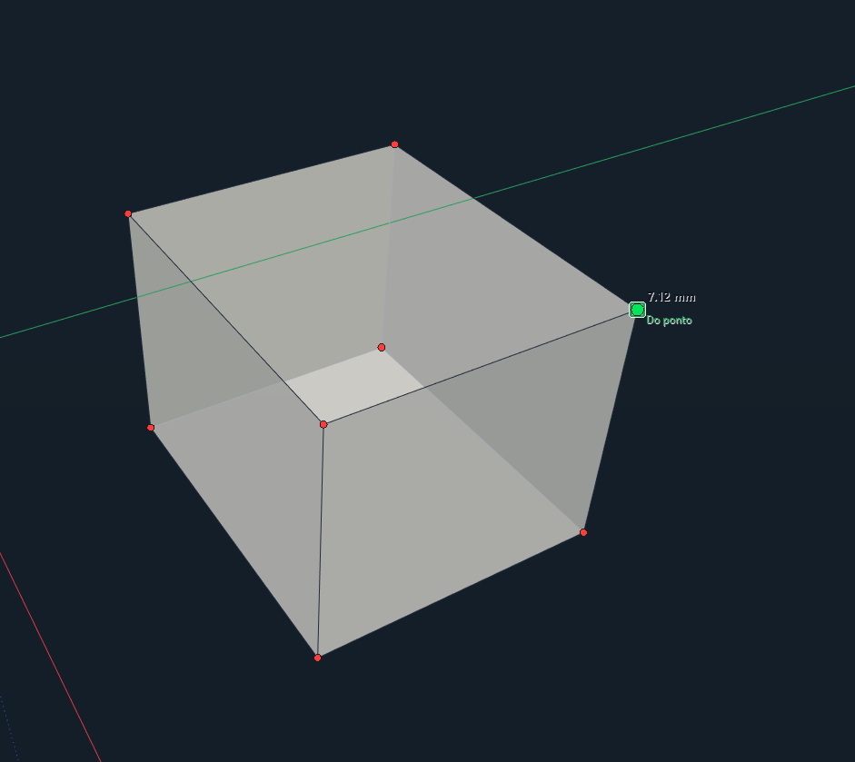
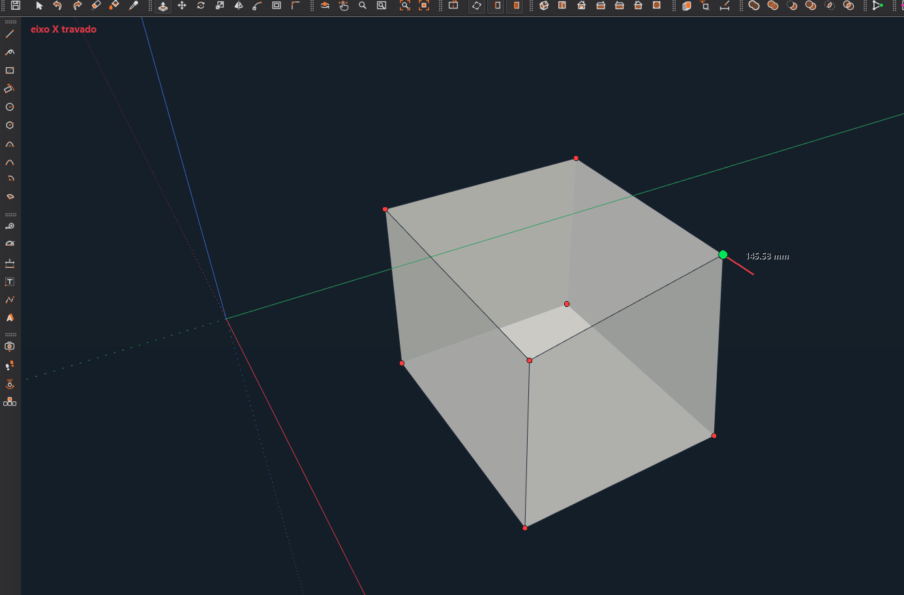
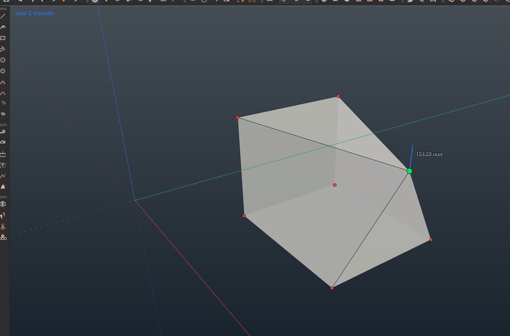
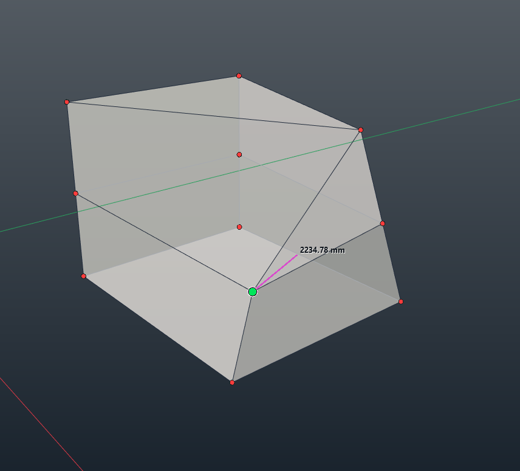

# Vertex Editor para IngeTrazo / Editor de Vértices para IngeTrazo

Extensión independiente para seleccionar y mover **un vértice de la malla activa** con vista previa, bloqueo de ejes y medidas exactas. Si se confirma sobre otro vértice, intenta unirlos sin abrir nuevas bordas en la malla.

Extensão independente para selecionar e mover **um vértice da malha ativa** com prévia, trava de eixos e medidas exatas. Se for confirmado sobre outro vértice, tenta uni-los sem abrir novas bordas na malha.

**Versión / Versão:** `v1.1` · **Archivo / Arquivo:** [`vertex_editor.py`](vertex_editor.py) · **Licencia / Licença:** MIT

## Capturas de uso / Capturas de uso

Cada imagen muestra un estado independiente de la herramienta; los encuadres no representan una grabación continua. / Cada imagem mostra um estado independente da ferramenta; os enquadramentos não representam uma gravação contínua.

### Vértices visibles / Vértices visíveis

Los puntos disponibles aparecen en rojo. / Os pontos disponíveis aparecem em vermelho.

### Identificación bajo el cursor / Identificação sob o cursor

IngeTrazo indica el punto detectado antes de seleccionarlo. / O IngeTrazo indica o ponto detectado antes da seleção.

### Vista previa y medida / Prévia e medida

El vértice activo se muestra en verde y el valor de distancia aparece junto a él. / O vértice ativo fica verde e a medida aparece ao lado.

### Ejes bloqueados / Eixos travados

Estas capturas muestran dos ejemplos independientes de inferencia: X y Z. / Estas capturas mostram dois exemplos independentes de inferência: X e Z.

**Eje X / Eixo X**

**Eje Z / Eixo Z**

### Edición en una pieza modificada / Edição em uma peça alterada

Ejemplo del vértice seleccionado en una geometría más compleja. / Exemplo do vértice selecionado numa geometria mais complexa.

## Instalación / Instalação

1. Descarga [`vertex_editor.py`](vertex_editor.py) / Baixe [`vertex_editor.py`](vertex_editor.py).
2. En IngeTrazo abre **Extensiones → Abrir carpeta de plugins** / No IngeTrazo abra **Extensões → Abrir pasta de plugins**.
3. Copia el archivo `.py` a esa carpeta. En Windows normalmente es `%APPDATA%\ingetrazo\plugins\` / Copie o `.py` para essa pasta.
4. Reinicia IngeTrazo / Reinicie o IngeTrazo.

La herramienta aparece en el menú **Extensiones** y en una barra separada **Vertex**, con un punto verde en su icono. / A ferramenta aparece no menu **Extensões** e numa barra separada **Vertex**, com um ponto verde no ícone.

## Uso / Uso

1. Activa **Editar vértice / Editar vértice** y haz clic en un punto rojo / Ative a ferramenta e clique num ponto vermelho.
2. Mueve el ratón para ver el desplazamiento de ese vértice y sus caras conectadas / Mova o mouse para ver o deslocamento desse vértice e das faces ligadas.
3. Haz clic para confirmar, o indica una dirección, escribe la distancia y pulsa **Enter** / Clique para confirmar ou aponte uma direção, digite a medida e pressione **Enter**.
4. Las teclas de IngeTrazo pueden bloquear X, Y o Z. **Esc** cancela la vista previa; **Ctrl+Z** deshace el cambio confirmado / As teclas do IngeTrazo podem travar X, Y ou Z. **Esc** cancela a prévia; **Ctrl+Z** desfaz a alteração confirmada.

Para unir puntos, sitúa el vértice seleccionado sobre otro vértice existente y confirma. La extensión usa su posición exacta, une coincidencias y elimina puntos huérfanos. Si la operación aumenta bordes abiertos, aristas sueltas o aristas no manifold, se revierte por completo. / Para unir pontos, posicione o vértice selecionado sobre outro ponto existente e confirme. A extensão usa a posição exata, une coincidências e remove pontos órfãos. Se a operação aumentar bordas abertas, arestas soltas ou arestas não manifold, ela será totalmente desfeita.

## Cambios de `v1.1` / Mudanças da `v1.1`

- Vista previa del desplazamiento mientras se mueve el cursor / Prévia do deslocamento durante o movimento do mouse.
- Entrada de distancias y bloqueo de ejes mediante la interfaz de IngeTrazo / Entrada de medidas e trava de eixos pela interface do IngeTrazo.
- Fusión de vértices coincidentes con verificación básica de topología / União de vértices coincidentes com verificação básica da topologia.
- Cancelación de la vista previa y operación confirmada reversible con `Ctrl+Z` / Cancelamento da prévia e operação confirmada reversível com `Ctrl+Z`.
- Botón propio en una barra independiente / Botão próprio numa barra separada.

## Compatibilidad y alcance / Compatibilidade e alcance

El archivo admite las API de plugins 1 y 2 de IngeTrazo. La herramienta trabaja sobre la **malla activa**, un vértice por operación. La fusión usa `mesh.weld_coincident()` en la malla activa y puede consolidar otras coincidencias existentes. La verificación evita los defectos que comprueba, pero no es una prueba universal de solidez de cualquier modelo. La API de plugins todavía puede cambiar durante las versiones 0.x de IngeTrazo.

O arquivo aceita as APIs de plugins 1 e 2 do IngeTrazo. A ferramenta atua na **malha ativa**, um vértice por operação. A união usa `mesh.weld_coincident()` na malha ativa e pode consolidar outras coincidências existentes. A verificação evita os defeitos que examina, mas não é uma prova universal de solidez de qualquer modelo. A API de plugins ainda pode mudar nas versões 0.x do IngeTrazo.

## Licencia / Licença

MIT. Consulte `LICENSE` no repositório.
